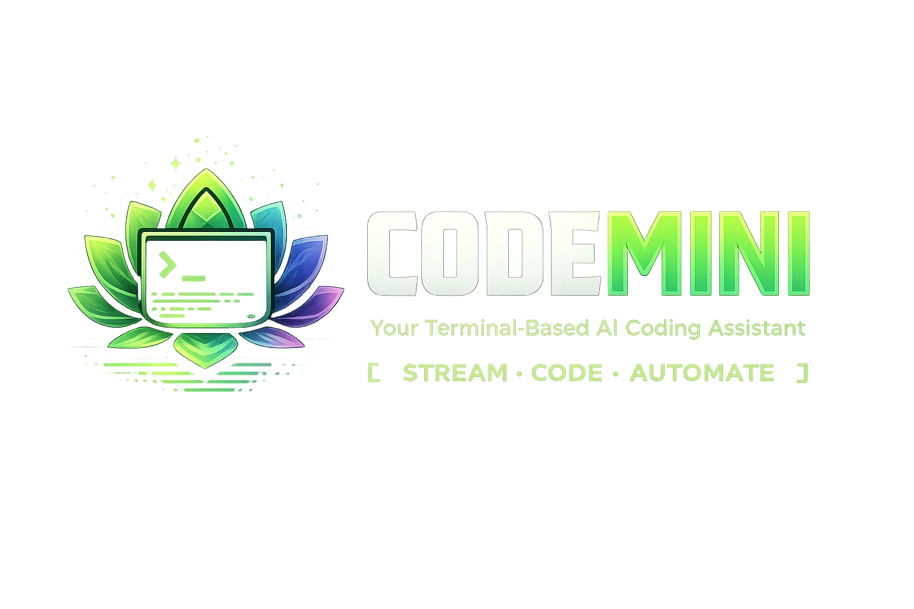

<div align="center">

<br />



# CodeMini

> A CLI coding agent, built from scratch — inspired by [Claude Code](https://claude.com/claude-code).

<br />

</div>

**CodeMini** is a terminal-based AI agent that talks to any OpenAI-compatible LLM and streams responses straight into your shell. It's the foundation for a fully-fledged coding assistant: today it does streaming chat over a clean, event-driven agent loop; the roadmap below covers where it's headed (tools, multi-turn sessions, file editing, and more).

> ⚠️ **Status: work in progress.** The core agent loop and streaming client are functional. Tool use, interactive sessions, and code-editing capabilities are not implemented yet.

---

## Features

- 🖥️ **Single-shot CLI** — ask a question, get a streamed answer
- 🔌 **Provider-agnostic** — works with any OpenAI-compatible API (OpenRouter, OpenAI, local servers, etc.) via `BASE_URL` / `API_KEY`
- 📡 **Real-time streaming** — tokens render as they arrive using [Rich](https://github.com/Textualize/rich)
- 🧱 **Event-driven architecture** — the agent emits a typed stream of events (`agent_start`, `text_delta`, `text_complete`, `agent_error`, `agent_end`), keeping the LLM, agent, and UI layers cleanly decoupled
- ♻️ **Resilient client** — automatic retries with exponential backoff on rate-limit and connection errors
- 📊 **Token accounting** — tracks prompt / completion / cached token usage per response

---

## Architecture

CodeMini is split into three decoupled layers connected by a stream of events:

```
                  ┌───────────────────────────────────────────────┐
   user input ──► │  main.py  (Click CLI → CLI class)              │
                  └───────────────────────┬───────────────────────┘
                                          │ message
                                          ▼
                  ┌───────────────────────────────────────────────┐
                  │  agent/agent.py  (Agent — async agentic loop)  │
                  │  emits AgentEvent stream                       │
                  └───────────────────────┬───────────────────────┘
                                          │ StreamEvent
                                          ▼
                  ┌───────────────────────────────────────────────┐
                  │  client/llm_client.py  (OpenAI-compatible)     │
                  │  streaming + retries + token usage             │
                  └───────────────────────────────────────────────┘

   AgentEvents ──► ui/renderer.py  (Rich console rendering)
```

### Project layout

| Path | Responsibility |
|------|----------------|
| `main.py` | Click entry point. `CLI` class runs a single message through the agent and renders the stream. |
| `agent/agent.py` | `Agent` — the async agentic loop. Wraps the LLM client and yields typed `AgentEvent`s. Async context manager that owns client lifecycle. |
| `agent/events.py` | `AgentEvent` / `AgentEventType` — the typed event protocol between the agent and the UI. |
| `client/llm_client.py` | `LLMClient` — async OpenAI-compatible wrapper. Handles streaming, retries with exponential backoff, and error classification. |
| `client/response.py` | Stream-layer dataclasses: `StreamEvent`, `StreamEventType`, `TextDelta`, `TokenUsage`. |
| `ui/renderer.py` | `Renderer` — renders streamed deltas and errors to the terminal via Rich. |

### Event flow

1. `Agent.run()` yields `agent_start`, then drives `_agentic_loop()`.
2. `_agentic_loop()` calls `LLMClient.chat_completion()`, which streams `StreamEvent`s from the provider.
3. Each `TEXT_DELTA` is translated into an `AgentEvent.text_delta` and forwarded to the renderer in real time.
4. On completion, the agent emits `text_complete` then `agent_end`; errors surface as `agent_error`.

---

## Requirements

- Python 3.10+ (uses `X | Y` union syntax and `match`-friendly typing)
- An API key for any OpenAI-compatible endpoint

Dependencies (see `requirements.txt`):

- [`openai`](https://pypi.org/project/openai/) — async client
- [`click`](https://pypi.org/project/click/) — CLI framework
- [`rich`](https://pypi.org/project/rich/) — terminal rendering
- [`tiktoken`](https://pypi.org/project/tiktoken/) — tokenization (planned use)
- [`python-dotenv`](https://pypi.org/project/python-dotenv/) — `.env` loading

---

## Setup

### 1. Clone and create a virtual environment

```powershell
git clone <your-repo-url> codemini
cd codemini

python -m venv .venv
.\.venv\Scripts\Activate.ps1     # Windows (PowerShell)
# source .venv/bin/activate      # macOS / Linux
```

### 2. Install dependencies

```powershell
pip install -r requirements.txt
```

### 3. Configure your provider

Create a `.env` file in the project root:

```dotenv
BASE_URL=https://openrouter.ai/api/v1
API_KEY=your-api-key-here
```

> `BASE_URL` and `API_KEY` are read at runtime by `LLMClient`. Any OpenAI-compatible endpoint works — OpenRouter, OpenAI directly, or a local server (e.g. Ollama, LM Studio). The default model is set in `client/llm_client.py`.

---

## Usage

Ask a single question (quote the prompt so it arrives as one argument):

```powershell
python main.py "tell me about llms"
```

The answer streams to your terminal as it's generated.

---

## Configuration

| Setting | Where | Notes |
|---------|-------|-------|
| `BASE_URL` | `.env` | API base URL of your provider |
| `API_KEY` | `.env` | API key for the provider |
| Model | `client/llm_client.py` (`chat_completion`) | Currently hard-coded; will move to config |
| Max retries | `client/llm_client.py` (`LLMClient._max_retries`) | Defaults to 3, with exponential backoff |

---

## Roadmap

CodeMini is early. Planned work toward a Claude Code–style experience:

- [ ] **Interactive REPL** — multi-turn conversation with persistent history
- [ ] **Tool / function calling** — let the agent run shell commands, read/write files, and search
- [ ] **File editing** — apply diffs and edits to the working tree
- [ ] **Configurable model & provider** — move the model out of code into config/flags
- [ ] **System prompts & context injection** — project-aware behavior
- [ ] **Token usage display** — surface the already-tracked `TokenUsage` in the UI
- [ ] **Tests** — unit coverage for the agent loop and client
- [ ] **Packaging** — installable `codemini` console script

---

## License

See [LICENSE](LICENSE).
